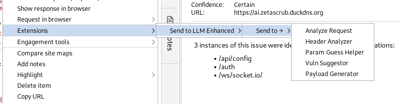
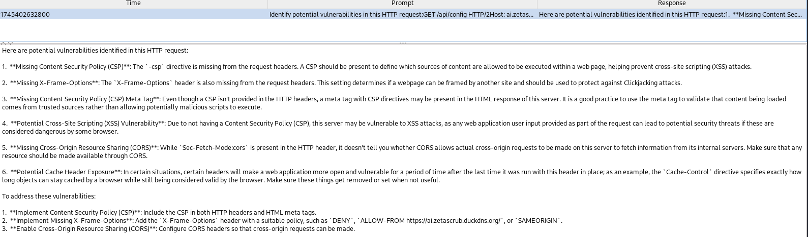

# 🧠 Send to LLM Enhanced (Burp Extension)

Send to LLM Enhanced is a Burp Suite extension that integrates powerful AI analysis into your web security workflow. It allows you to send HTTP requests directly from Burp to a locally or remotely hosted large language model (LLM) for intelligent insights and automated assessments.
## ✨ Features

    🔍 Right-click "Send to →" Menu
    Use context menus to send requests to specialized AI tools:

        Analyze Request – General-purpose LLM analysis

        Header Analyzer – Review HTTP headers for missing security features

        Param Guess Helper – Suggest hidden or common fuzzing parameters

        Vuln Suggestor – Automatically identify potential vulnerabilities (e.g., CSP, CORS, XSS)

        Payload Generator – Create attack payloads like XSS or SQLi

    📋 History Tab
    Track all prompts and LLM responses in a scrollable, resizable panel.

    🛠 Pentester Tools Tab
    Test different prompt templates interactively within the extension.

    💬 Custom Templates
    Modify or add your own prompt formats via the "Config" tab.

## 📸 Screenshots

### 🔹 Context Menu - "Send to →"


### 🔹 Vuln Suggestor Output (in History Tab)



## ⚙️ Requirements

```
Burp Suite Professional or Community

Java 8+

A local or remote LLM endpoint (e.g. Ollama or OpenAI-compatible server)
```

## 🚀 Usage

    Load the .jar file into Burp via the Extender → Extensions tab.

    Right-click any request in the Proxy or Repeater tab.

    Choose Extensions → Send to LLM Enhanced → Send to → [Tool].

    View the result in the LLM Console under the History tab or try other tools in the Pentester Tools tab.

## 🧠 Model Compatibility

This extension is designed to work with any OpenAI-compatible API endpoint. By default, it targets:

POST http://localhost:11434/v1/chat/completions
Model: llama3.2

This is compatible with Ollama, but can be customized in the Config tab.
### 📝 Customization (WIP)

    Add your own prompt templates via the Config tab.

    Adjust model and endpoint fields as needed for different environments.

## 📦 Building

```bash
javac -cp burpsuite_pro_v2025.2.4.jar:json-20230227.jar BurpExtender.java
jar cf SendToLLM.jar BurpExtender.class
```

or

```bash
./build.sh burpsuite_pro_v2025.2.4.jar json-20230227.jar
```